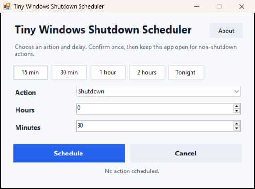

# Tiny Windows Shutdown Scheduler

**Tiny Windows Shutdown Scheduler** is a small portable **Windows shutdown timer** and **Windows shutdown scheduler** for shutdown, restart, sleep, hibernate, lock, and log off actions.

It is designed for people who want a fast, simple, no-install Windows power timer: download one EXE, choose a delay, confirm, and let Windows handle the action.



---

## 📑 Quick Navigation

| [📥 Download](#download) | [✨ Features](#features) | [❓ FAQ](#faq) | [🔧 Build](#build-from-source) | [📖 Docs](#documentation) | [💬 Discussions](#community) |
|:---:|:---:|:---:|:---:|:---:|:---:|

---

## 📥 Download

Download the latest release:

**[Tiny Windows Shutdown Scheduler.exe](https://github.com/pavanbadempet/tiny-windows-shutdown-scheduler/releases/latest)**

The app is portable. No installer, no Python, no Electron, no account, no background service.

### System Requirements
- Windows 7 or later
- .NET Framework (usually already installed)
- ~29 KB disk space

---

## ✨ Why Use It

- Tiny native Windows executable, about 29 KB
- Simple Windows shutdown timer with hours and minutes
- Restart timer, sleep timer, hibernate timer, lock timer, and log off timer
- Presets for 15 minutes, 30 minutes, 1 hour, 2 hours, and tonight
- Confirmation before scheduling a power action
- Live countdown while the timer is running
- Cancel button for scheduled shutdown/restart and in-app timers
- No terminal window
- Open source under the MIT License

---

## 🎯 Features

| Feature | Supported |
| --- | --- |
| Schedule shutdown | ✅ Yes |
| Schedule restart | ✅ Yes |
| Schedule sleep | ✅ Yes |
| Schedule hibernate | ✅ Yes |
| Schedule lock | ✅ Yes |
| Schedule log off | ✅ Yes |
| Live countdown | ✅ Yes |
| Preset timers | ✅ Yes |
| Portable EXE | ✅ Yes |
| Installer required | ❌ No |

---

## 🔍 Common Searches This App Solves

This project is meant to be a clean open-source answer for:

- Windows shutdown timer
- Windows shutdown scheduler
- Portable shutdown timer for Windows
- Tiny shutdown timer EXE
- Schedule Windows shutdown after 30 minutes
- Schedule Windows restart timer
- Windows sleep timer
- Windows hibernate timer
- Lock Windows after timer
- Log off Windows after timer

---

## ⚙️ How It Works

For shutdown and restart, the app uses Windows' built-in scheduler commands:

```text
shutdown /s /t <seconds>
shutdown /r /t <seconds>
shutdown /a
```

For hibernate, lock, and related actions, it uses standard Windows commands such as:

```text
shutdown /h
rundll32 user32.dll,LockWorkStation
```

Shutdown and restart timers are scheduled through Windows, so they can still run after closing the app. Sleep, hibernate, lock, and log off timers are handled by the app, so keep it open until the timer completes.

### ⚠️ Important

Save your work before scheduling a shutdown, restart, sleep, hibernate, lock, or log off action.

---

## ❓ FAQ

**Q: Can the shutdown run after I close the app?**
A: Yes, for shutdown and restart timers. For sleep, hibernate, lock, and log off, you need to keep the app open.

**Q: Is this safe to use?**
A: Yes. The app uses Windows' native commands and includes a confirmation dialog before executing any action.

**Q: Can I run multiple timers?**
A: You can run multiple instances of the app, each with its own timer.

**Q: Will this work on Windows 10/11?**
A: Yes, this works on Windows 7 and later, including Windows 10 and Windows 11.

**Q: Can I customize the timers?**
A: Yes, you can set any custom time in hours and minutes, plus use preset shortcuts.

---

## 🔧 Build From Source

Requires Windows with the .NET Framework C# compiler.

```powershell
build.bat
```

The executable is created at:

```text
dist\Tiny Windows Shutdown Scheduler.exe
```

### Development Setup

1. Clone the repository:
   ```bash
   git clone https://github.com/pavanbadempet/Tiny-Windows-Shutdown-Scheduler.git
   cd Tiny-Windows-Shutdown-Scheduler
   ```

2. Build the project:
   ```powershell
   build.bat
   ```

3. Run the executable from `dist` folder

---

## 📖 Documentation

- **[Wiki](../../wiki)** - Detailed documentation and guides
- **[Issues](../../issues)** - Bug reports and feature requests
- **[Discussions](../../discussions)** - Ask questions and share ideas
- **[Releases](../../releases)** - Version history and changelog

---

## 💬 Community

Have questions or ideas? Join our [Discussions](../../discussions) section to:
- Ask for help
- Suggest new features
- Share tips and tricks
- Connect with other users

Found a bug? Please [create an issue](../../issues/new).

---

## 🎯 Project Positioning

Tiny Windows Shutdown Scheduler is intentionally small. It is not an Electron app, not a Python bundle, and not a heavy automation suite. It focuses on one job: a fast, portable Windows shutdown scheduler.

---

## 📄 License

MIT License. See [LICENSE](LICENSE).

---

## 🌟 Support

If you find this project helpful, please consider:
- ⭐ Giving it a star on GitHub
- 🐛 Reporting bugs
- 💡 Suggesting improvements
- 📢 Sharing with others

---

**Made with ❤️ by [pavanbadempet](https://github.com/pavanbadempet)**
